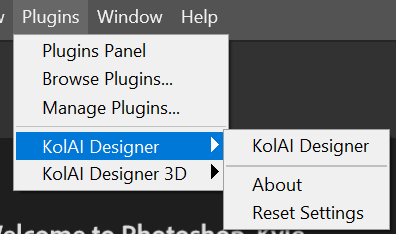

{width="300", align=right}

# Photoshop Plugin

The Photoshop Plugin allows users to access KolAi's A.I. system from within Photoshop.
<!--
<figure markdown="span">
  <image src="../../assets/ps-plugin-01.png" 
         alt="KolAi Laser Designer Photoshop Plugin window"
         style="width:40%">
  <!-- <figcaption>KolAi Laser Designer Photoshop Plugin</figcaption> 
</figure>
-->

## How to Get The Plugin

### 1. Download 

Download here: [store.kolaidenim.com](https://store.kolaidenim.com/b/4tKzG){target="_blank"}

!!! Note
    In order to use the plugin, you will also need a KolAi Designer account which enables access to the A.I.

### 2. Sign up for KolAi Designer Account
Sign up and purchase tokens or a subscription plan here: [kolaidesigner.com/select-plan](https://www.kolaidesigner.com/select-plan/){target="_blank"}

!!! Note
    * You can get access to a free KolAi Designer account with a limited number of A.I. uses if you sign up for the training course: [training.kolaidenim.com](https://store.kolaidenim.com/collection/training-course){target="_blank"}
    * You can also get access to a limited number of uses directly from the plugin page: [store.kolaidenim.com](https://store.kolaidenim.com/b/4tKzG){target="_blank"}

## How to Install the Plugin

Once you download the plugin, it is easy to install. 

*Simply double-click on the .ccx file.* This will open Creative Cloud and automatically install the plugin. 

<figure markdown="span">
  <image src="../../assets/creative-cloud.png" 
         alt="Creative Cloud Plugins Window"
         style="width:60%">
  <figcaption>Creative Cloud Plugins Window</figcaption>
</figure>

!!! Note
    The plugin only works for versions of Photoshop released in 2021 or later.  

<!-- {width="300", align=right} -->

Once you have installed the plugin, you can access it via Plugins -> KolAi Designer

<!-- {width=200} -->

<figure markdown="span">
  <image src="../../assets/ps-plugin-02.png" 
         alt="Photoshop Menu showing KolAi Designer"
         style="width:50%">
  <!-- <figcaption>How to access KolAi Designer Plugin in Photoshop</figcaption> -->
</figure>

## How to Use the Plugin

{width="150", align=right}

### 1. Log in with your KolAi Designer Account

Once you open the plugin window in Photoshop, you will first need to log in with your KolAi Designer account.

### 2. Open image of target garment in Photoshop

To use the plugin, first open an image of your target garment in Photoshop. You will use the plugin to extract the dry process from this target garment. 

#### Image requirements

1. Currently, the A.I. works with pants only. It will not make dry process templates for jackets, skirts or other types of garments. It can work with shorts, but you must first paste the shorts onto a full-length pant. It works for both fronts and backs of pants.
2. You must upload the entire leg panel for best results. The A.I. has been trained with full leg panels, so it so it works best if you upload the entire leg panel.
3. The A.I. will make the wear pattern only. This includes whiskers, chevrons, back-knee honeycombs, and all kinds of scraping / abrasion. It will not process damages, patchwork, graffiti, or all-over prints.

<figure markdown="span">
  <image src="../../assets/allowed-input.png" 
         alt="Examples of garment images that work with the A.I."
         style="width:50%">
  <figcaption>Examples of target garment images that will work (left) and won't work (right) with the A.I.</figcaption>
</figure>
 
<!-- {width="150", align=right} -->

### 3. Select leg panel

The plugin has a guided sequence of steps (KolAi Step 1 -> KolAi Step 2 -> KolAi Step 3). Step 1 instructs you to select one leg panel. Do this with the Polygonal Lasso tool. 

<figure markdown="span">
  <image src="../../assets/select-leg-panel.png" 
         alt="Select leg panel in PS"
         style="width:50%">
  <figcaption>Select leg panel using Polygonal Lasso tool</figcaption>
</figure>

### 4. Click "KolAi Step 2"

This will run some automatons in Photoshop and open your target image in a new file called "KOLAI PROCESS". 

Make sure you don't crop or mask your selection from the previous section. Simply click "KolAi Step 2" with the leg panel still surrounded by marching ants (as pictured).

### 5. Click "KolAi Step 3"

This will send your garment image to our A.I. server and return the dry process laser template (you could also click "KolAi AI Process" instead of "KolAi Step 3" - it will have the same effect). 

!!! Note
    You must be connected to the internet for this step to work.

<figure markdown="span">
  <image src="../../assets/kolai-design-layers.jpg" 
         alt="KolAi Design Layers"
         style="width:80%">
  <figcaption>The layers returned by KolAi's A.I.</figcaption>
</figure>

<!-- {width="500", align=right} -->

The dry process template comes back in 4 layers:

1. AI Single Layer - All design elements in a single layer
2. AI Abrasion - Just the abrasion / scraping elements
3. AI Whiskers - Just the whisker elements
4. Texture Enhancement - Garment texture, extracted from the original garment image

### Other Features

The plugin contains several other features that make it easier to design laser templates. Below, we will give a brief explanation of each feature. 

To see exactly how to use all of these features, follow along with this short video:

#### Adjust Grayscale

Makes a Grayscale Adjustment layer that allows you to easily adjust the grayscale of your design to match the needs of your particular laser machine. 

#### Extract Pattern

Transforms any image (for example, snakeskin, a cammo pattern, a picture of flowers) to be compatible with a laser machine. 

#### Apply Texture

Makes a texture overlay (e.g., a stonewash effect) on your design. You can easily change the texture properties and switch out different textures.

KolAi also offers a [texture pack](https://store.kolaidenim.com/b/EGUyk){target="_blank"} you can download with over 60 unique textures, selected to laser well onto garments. 

#### Basic Highlight

Make a "Basic Highlight" layer on top of your design. Sometimes you get better results on a laser when you mark in multiple layers. The Basic Highlight layer could be used as a second marking layer on your laser machine, to give more depth to the final design. 